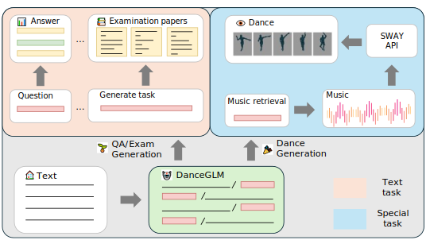
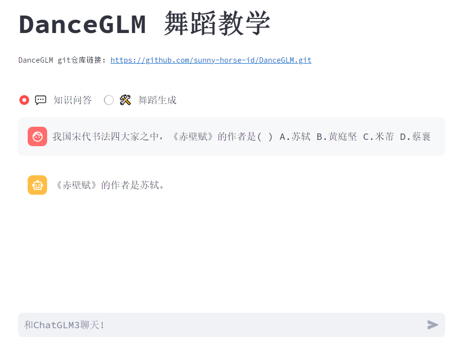
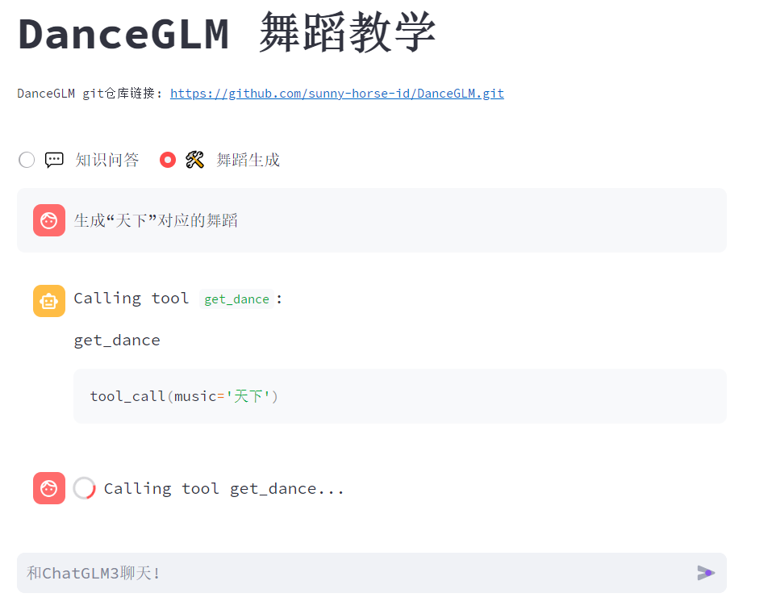
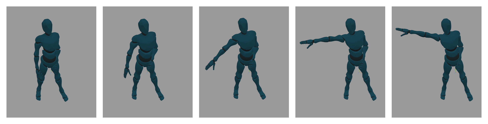

## 安装

我们建议通过 [Conda](https://docs.conda.io/en/latest/) 进行环境管理。

执行以下命令新建一个 conda 环境并安装所需依赖：

```bash
conda create -n sway python=3.10
activate sway
pip install torch torchvision torchaudio --index-url https://download.pytorch.org/whl/cu118
pip install git+https://github.com/facebookresearch/pytorch3d.git
pip install git+https://github.com/rodrigo-castellon/jukemirlib.git
pip install accelerate
#此处根据您的服务器配置自行选择
accelerate config
pip install -r requirements.txt
```

## 依赖说明
```bash
运行环境：
Ubuntu 22.04

vue依赖：
下载链接：https://pan.baidu.com/s/1Zpn1HTkitNg47b5DtqziKA?pwd=zdax 
使用方法：下载解压后整体放到vue/frontend文件夹下

SWAY.checkpoint依赖：
下载链接：https://pan.baidu.com/s/1t5hRfg60sns0RfCaGmH7AQ?pwd=cy8z 
使用方法：下载后放到SWAY文件夹下
```

## 引用
```bash
更多详细内容请访问：
https://github.com/THUDM/ChatGLM3
https://github.com/Stanford-TML/EDGE
https://google.github.io/aistplusplus_dataset
```